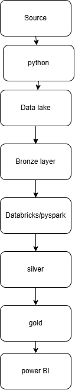

# 🛒 ShopSphere Data Engineering Platform

An end-to-end, production-style e-commerce data engineering pipeline demonstrating batch ingestion, data quality, PySpark transformations, dimensional modeling, SCD Type 2, idempotent fact loading, PostgreSQL, and Apache Airflow orchestration.

## 📌 Project Overview

ShopSphere simulates an e-commerce data platform that processes customer, product, order, order-item, and payment data.

The pipeline takes raw CSV data through a Bronze → Silver → Warehouse → Gold architecture and produces business-ready analytical datasets.

The project is implemented locally to avoid cloud infrastructure costs, while the architecture is designed to map naturally to AWS services.

## 🏗️ Architecture



### Pipeline Flow

```text
Raw CSV Files
     │
     ▼
┌─────────────┐
│   BRONZE    │
│ Raw Batches │
└──────┬──────┘
       │
       ▼
┌─────────────┐
│   SILVER    │
│   PySpark   │
│ Clean/DQ    │
└──────┬──────┘
       │
       ▼
┌──────────────────────┐
│ PostgreSQL Staging   │
└──────────┬───────────┘
           │
           ├──────────────┐
           ▼              ▼
      SCD Type 2      Fact Sales
      Dimensions          │
           │              │
           └──────┬───────┘
                  ▼
             GOLD VIEWS
                  │
                  ▼
          Data Quality Checks
                  │
                  ▼
              Airflow DAG
````

## 🔄 Data Pipeline

The pipeline processes five source datasets:

* Customers
* Products
* Orders
* Order Items
* Payments

### Bronze Layer

Raw source files are stored using batch-based directories:

```text
data/bronze/
└── batch_<batch_id>/
    ├── customers/
    ├── products/
    ├── orders/
    ├── order_items/
    ├── payments/
    └── manifest
```

Each ingestion creates a unique batch ID.

Example:

```text
batch_20260923_000000
```

### Silver Layer

PySpark transformations perform:

* Deduplication
* NULL validation
* Data type handling
* Business-rule validation
* Negative value validation
* Referential integrity checks
* Rejection of invalid records

Silver data is stored in Parquet format.

## 🧹 Data Quality

The project intentionally injects data-quality issues into the source datasets to simulate real-world scenarios.

Examples include:

* Duplicate customer IDs
* NULL customer emails
* Duplicate order IDs
* NULL customer IDs
* Negative order amounts
* Orphan customer IDs
* Missing order IDs in order items
* Duplicate payment IDs
* Negative payment amounts

Invalid records are separated during Silver processing rather than silently entering downstream tables.

### Final Fact Table DQ

The pipeline validates:

* NULL customer keys
* NULL product keys
* NULL date keys
* Negative sales amounts
* Invalid quantities
* Duplicate sales records

The final validation completed successfully:

```text
NULL customer keys       : 0
NULL product keys        : 0
NULL date keys           : 0
Negative sales amounts   : 0
Invalid quantities       : 0
Duplicate sales keys     : 0
```

## 🧱 Dimensional Modeling

The warehouse layer contains:

### Dimensions

```text
dim_customer
dim_product
dim_date
```

### Fact

```text
fact_sales
```

### Fact Grain

The grain of `fact_sales` is:

> One product line item within one customer order.

The fact table uses `order_item_id` to provide idempotent loading.

Final validation:

```text
Total fact rows        : 298,508
Distinct order_item_id : 298,508
Duplicate records      : 0
```

## 🔁 SCD Type 2

Customer and product dimensions use Slowly Changing Dimension Type 2.

Historical versions are retained rather than overwritten.

Final validation:

```text
dim_customer
Total rows   : 9,903
Current rows : 9,901

dim_product
Total rows   : 1,002
Current rows : 1,000
```

This allows historical attribute changes to be preserved.

## 📊 Gold Layer

Business-facing PostgreSQL views provide analytical outputs:

### `gold_daily_sales`

Provides:

* Daily orders
* Quantity sold
* Total sales
* Average line-item value

### `gold_product_performance`

Provides:

* Product-level quantity
* Sales
* Orders
* Average unit price

### `gold_customer_performance`

Provides customer-level sales and order metrics.

### `gold_category_performance`

Provides:

* Category sales
* Quantity sold
* Orders
* Average unit price

Example categories:

```text
Electronics
Books
Fashion
Beauty
Home
Sports
```

## 🚀 Apache Airflow

The complete pipeline is orchestrated using Apache Airflow.

### DAG

```text
shopsphere_pipeline
```

The DAG coordinates:

```text
Ingestion
    ↓
Silver Transformations
    ↓
PostgreSQL Staging
    ↓
SCD Type 2
    ↓
Fact Sales
    ↓
Data Quality Checks
```

The complete DAG has been successfully executed end-to-end.

## 📦 Final Pipeline Results

Latest successful pipeline execution:

| Dataset            | Records |
| ------------------ | ------: |
| Silver Customers   |   9,900 |
| Silver Products    |   1,000 |
| Silver Orders      |  99,751 |
| Silver Order Items | 298,508 |
| Silver Payments    |  99,701 |
| Fact Sales         | 298,508 |

## ☁️ AWS Architecture Mapping

The current implementation runs locally to avoid unnecessary cloud costs.

The architecture can be mapped to AWS as follows:

| Local Implementation    | AWS Equivalent                        |
| ----------------------- | ------------------------------------- |
| Local Bronze data lake  | Amazon S3                             |
| PySpark transformations | AWS Glue                              |
| PostgreSQL warehouse    | Amazon Redshift                       |
| Apache Airflow          | Amazon MWAA                           |
| Parquet                 | S3 + Parquet                          |
| Python ingestion        | AWS Glue / Lambda                     |
| Data Quality checks     | AWS Glue Data Quality / custom checks |

This separation allows the project to demonstrate cloud-oriented architecture without requiring continuous AWS infrastructure.

## 🛠️ Technology Stack

* Python
* PySpark
* PostgreSQL
* Apache Airflow
* SQL
* Pandas
* Parquet
* Git / GitHub

## 📂 Project Structure

```text
shopsphere-data-platform/
│
├── architecture/
│   └── architecture.png
│
├── ingestion/
│   ├── generate_data.py
│   ├── inject_data_quality_issues.py
│   ├── ingest_data.py
│   ├── run_silver.py
│   ├── data_quality_checks.py
│   ├── scd2_customer.py
│   ├── scd2_product.py
│   └── load_*_to_postgres.py
│
├── pyspark/
│   └── silver/
│       ├── customers_clean.py
│       ├── products_clean.py
│       ├── orders_clean.py
│       ├── order_items_clean.py
│       └── payments_clean.py
│
├── sql/
│   ├── dimensions/
│   ├── facts/
│   └── data_quality/
│
├── README.md
├── requirements.txt
└── .gitignore
```

## ▶️ Running the Project

### 1. Clone the repository

```bash
git clone https://github.com/sapnabishtt/shopsphere-data-platform.git
cd shopsphere-data-platform
```

### 2. Create a Python environment

```bash
python -m venv .venv
source .venv/bin/activate
```

### 3. Install dependencies

```bash
pip install -r requirements.txt
```

### 4. Configure PostgreSQL

Create a local PostgreSQL database and configure the following environment variables:

```text
DB_HOST
DB_PORT
DB_NAME
DB_USER
DB_PASSWORD
```

Keep credentials in a local `.env` file. Do not commit `.env` to GitHub.

### 5. Run the pipeline

The pipeline can be executed through Apache Airflow using:

```text
shopsphere_pipeline
```

## 🎯 Key Engineering Concepts Demonstrated

This project focuses on practical Data Engineering concepts:

* Batch-based ingestion
* Bronze / Silver / Gold architecture
* PySpark transformations
* Parquet processing
* Data quality validation
* Rejected-record handling
* PostgreSQL staging
* Dimensional modeling
* Slowly Changing Dimensions Type 2
* Fact-table grain design
* Idempotent processing
* Airflow orchestration
* Incremental batch processing
* Cloud architecture mapping

## 📈 Business Use Cases

The Gold layer enables analysis such as:

* Daily sales trends
* Product performance
* Category performance
* Customer purchasing behavior
* Quantity and revenue analysis

## 👩‍💻 Author

**Sapna Bisht**

Data Engineer | Python | SQL | PySpark | AWS | Data Engineering

---

⭐ If you find this project useful, feel free to explore the implementation and architecture.

